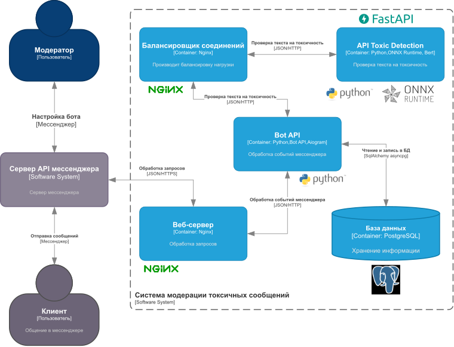

# ForgetToxicChat 
###### Bot for filtering and moderating toxic text messages in Russian in Telegram chats

### Requirements

* Python 3.10
* transformers 4.27.4
* onnxruntime 1.14.1
* fastapi 0.95.1
* pydantic 1.10.7
* uvicorn 0.21.1
* gunicorn 20.1.0
* aiogram 3.0.0b7
* PostgreSQL
* SQLAlchemy 2.0.7
* asyncpg 0.27.0
* pydantic 1.10.7
* alembic 1.10.4
* environs 9.5.0
* nginx
* Docker container 20.10.23


### Building

###### Docker instructions:

```
# Clone this repository
$ git clone https://github.com/alexandr-khvatov/ForgetToxicChat.git

# Go into the repository
$ cd ForgetToxicChat

# Build and run container
$ docker-compose --env-file .env.example -f .\docker-compose.yml up

```

### Application architecture
###### Presented in C4 notation


